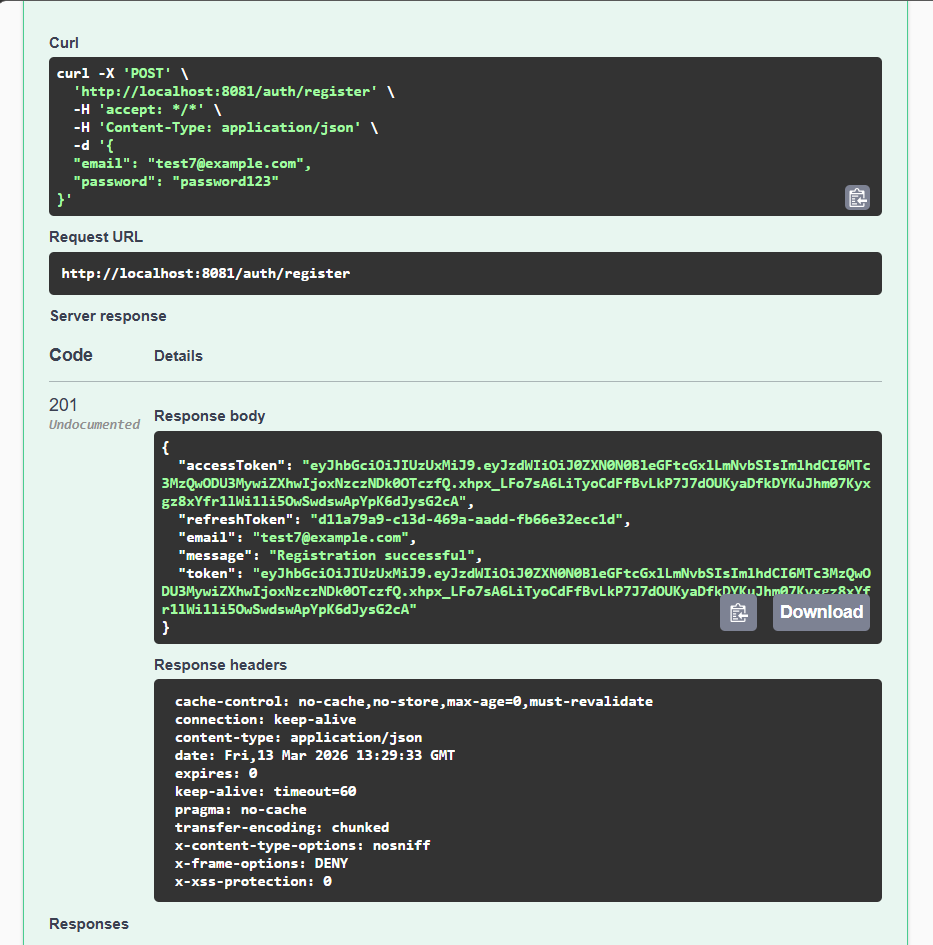
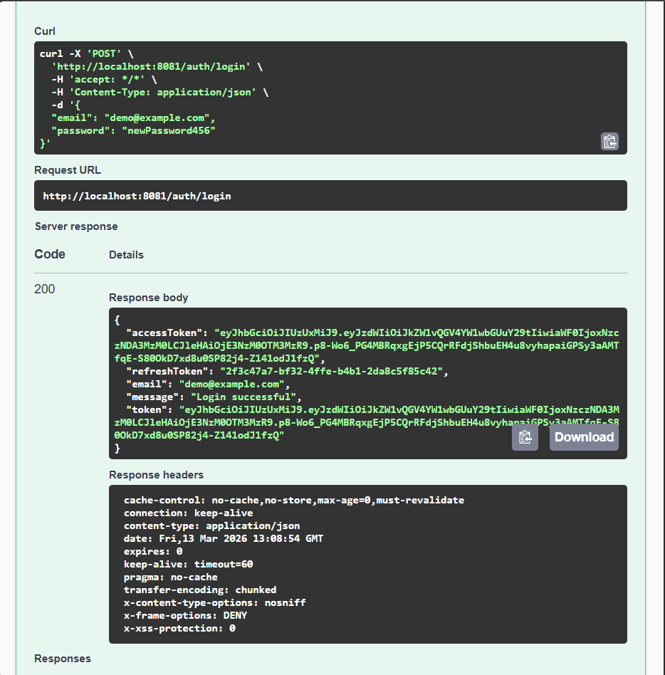
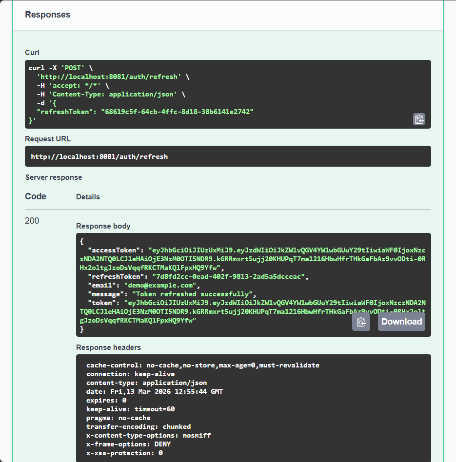
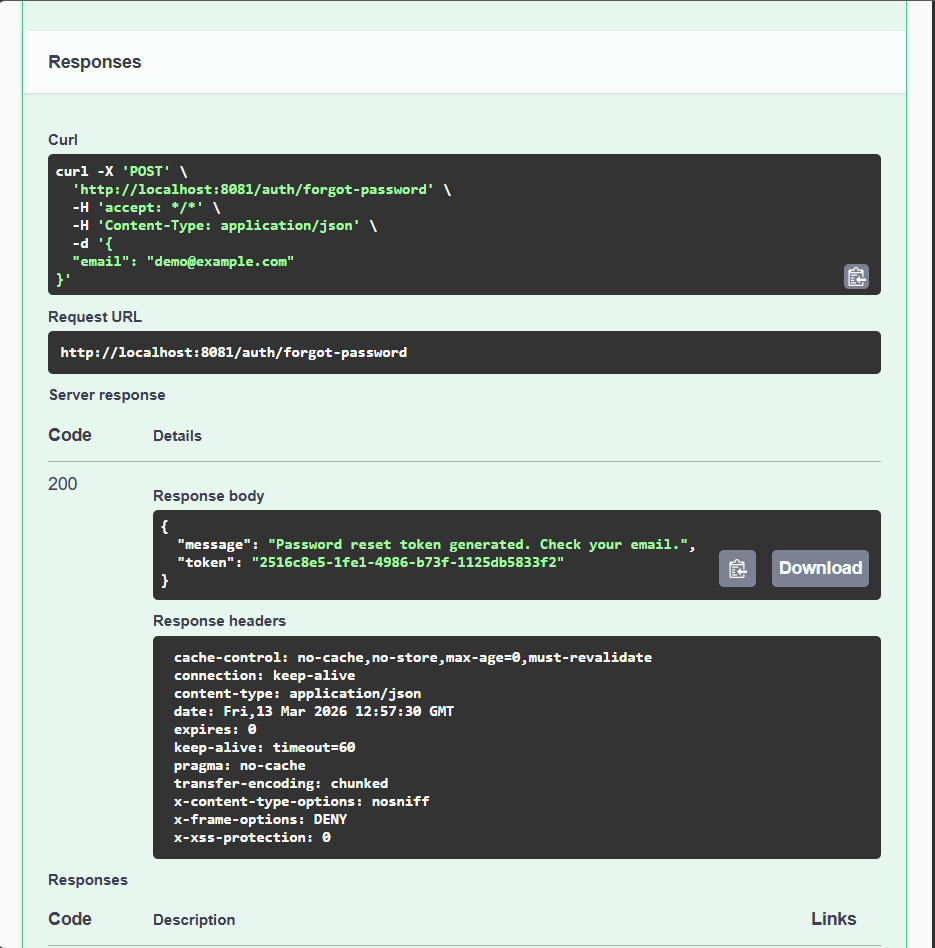
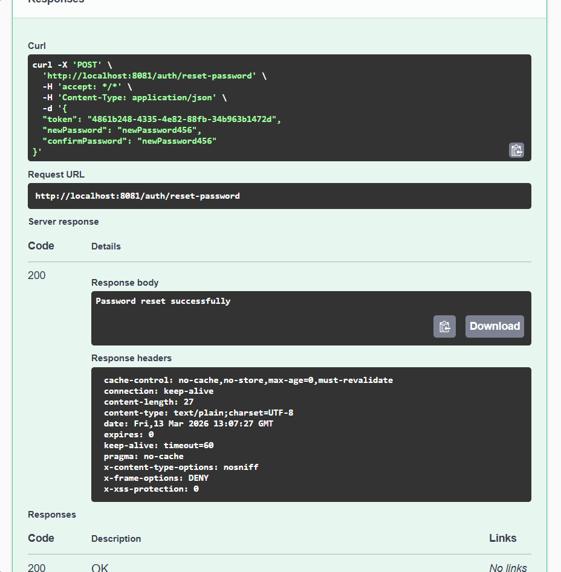
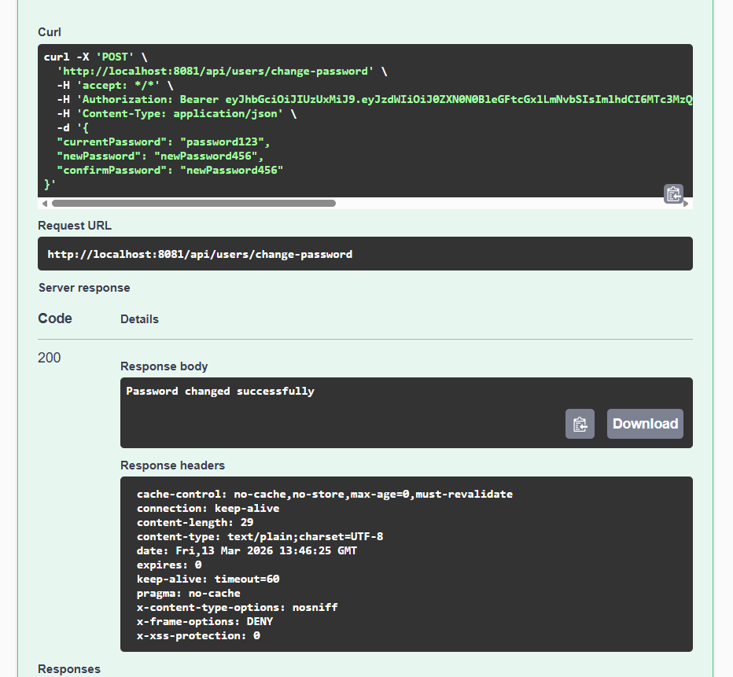
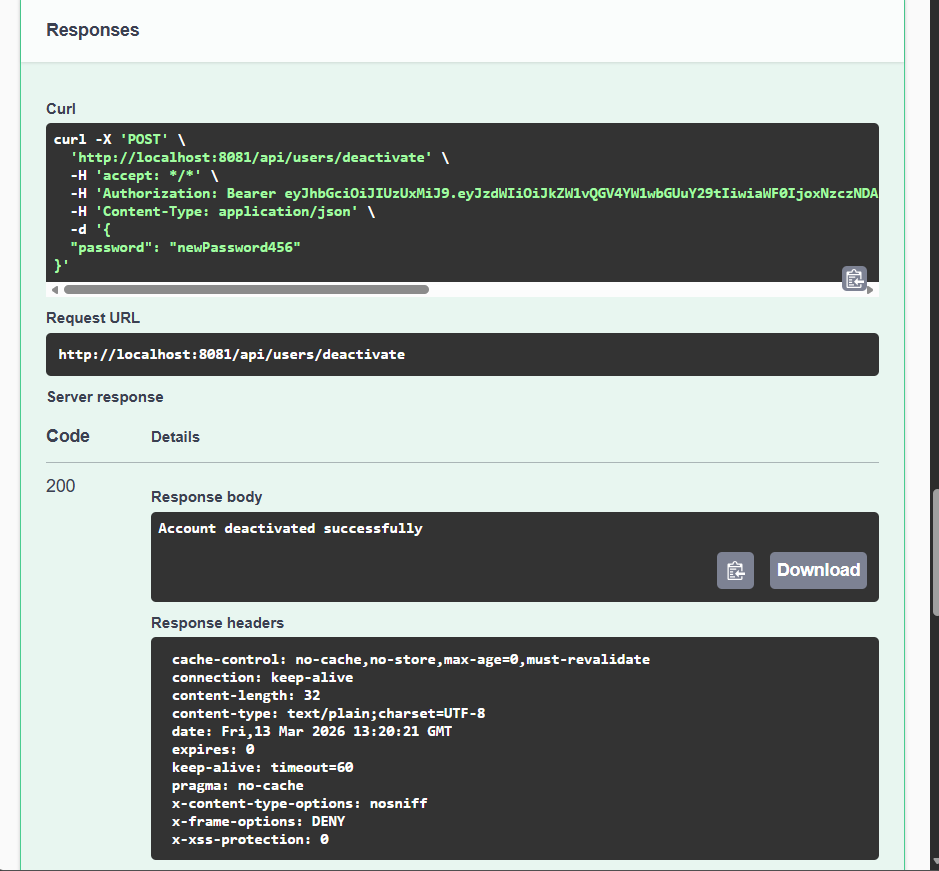

# User Management System - Backend API

[](https://www.oracle.com/java/)
[](https://spring.io/projects/spring-boot)
[](LICENSE)
[](https://github.com)

A modern and secure user management system REST API built with Spring Boot 3, Spring Security, JWT authentication, and PostgreSQL.

## 📸 Screenshots

### Swagger UI

*API Documentation - All endpoints can be tested interactively*

### v1.1.0 Features

#### Register Response

*User registration with access token and refresh token*

#### Login Response

*User login with JWT tokens*

#### Refresh Token

*Token refresh with rotation - old token revoked, new tokens issued*

#### Forgot Password

*Password reset token generation*

#### Reset Password

*Password reset with token*

#### Change Password

*Authenticated user changing password*

#### Deactivate Account

*User deactivating their own account*

## 🚀 Technologies

- **Java 17** - LTS version
- **Spring Boot 3.3.7** - Latest stable version
- **Spring Security** - Authentication & Authorization
- **JWT (JSON Web Token)** - Token-based authentication
- **Spring Data JPA** - Database operations
- **PostgreSQL 16** - Relational database
- **Docker & Docker Compose** - Containerization
- **Swagger/OpenAPI** - API Documentation
- **JUnit 5 & Mockito** - Testing
- **BCrypt** - Password encryption

## 📋 Features

### v1.0.0 (Released)
- ✅ JWT-based authentication
- ✅ BCrypt password encryption
- ✅ Role-based access control (USER, ADMIN)
- ✅ RESTful API endpoints
- ✅ Global exception handling
- ✅ Input validation
- ✅ Swagger UI documentation
- ✅ Unit & Integration tests
- ✅ Docker support

### v1.1.0 (Released)
- ✅ Change password functionality
- ✅ Account deactivation (soft delete)
- ✅ Password reset with token
- ✅ Refresh token mechanism with rotation

### v1.2.0 (Planned)
- 🚧 Email verification
- 🚧 Rate limiting
- 🚧 Redis caching

## 🏗️ Architecture

```
src/
├── main/
│   ├── java/com/backend/usermanagement/
│   │   ├── config/          # Configuration classes
│   │   ├── controller/      # REST Controllers
│   │   ├── domain/entity/   # JPA Entities
│   │   ├── dto/             # Data Transfer Objects
│   │   ├── exception/       # Exception handling
│   │   ├── repository/      # JPA Repositories
│   │   ├── security/        # Security & JWT
│   │   └── service/         # Business logic
│   └── resources/
│       └── application.properties
└── test/                    # Test classes
```

## 🔧 Installation

### Prerequisites

- Java 17+
- Maven 3.6+
- Docker & Docker Compose

### 1. Clone the Repository

```bash
git clone <repository-url>
cd user-management-service
```

### 2. Start PostgreSQL

```bash
docker-compose up -d
```

### 3. Run the Application

```bash
./mvnw spring-boot:run
```

The application will start at `http://localhost:8081`

## 📚 API Endpoints

### Authentication

| Method | Endpoint | Description | Auth Required |
|--------|----------|-------------|---------------|
| POST | `/auth/register` | Register new user | ❌ |
| POST | `/auth/login` | User login | ❌ |
| POST | `/auth/refresh` | Refresh access token | ❌ |
| POST | `/auth/forgot-password` | Request password reset | ❌ |
| POST | `/auth/reset-password` | Reset password with token | ❌ |

### User Management

| Method | Endpoint | Description | Auth Required |
|--------|----------|-------------|---------------|
| GET | `/api/users` | List all users | ✅ ADMIN |
| GET | `/api/users/{id}` | Get user details | ✅ ADMIN |
| DELETE | `/api/users/{id}` | Deactivate user | ✅ ADMIN |
| PUT | `/api/users/{id}/roles/{roleName}` | Add role to user | ✅ ADMIN |
| POST | `/api/users/change-password` | Change password | ✅ USER |
| POST | `/api/users/deactivate` | Deactivate own account | ✅ USER |

## 📖 API Documentation

Swagger UI: `http://localhost:8081/swagger-ui.html`

OpenAPI Docs: `http://localhost:8081/v3/api-docs`

## 🔐 Authentication Flow

1. **Register**: Send email and password to `/auth/register`
2. **Login**: Send credentials to `/auth/login`
3. **Token**: Receive JWT token in response
4. **Authorization**: Add token to header for protected endpoints:
   ```
   Authorization: Bearer <your-jwt-token>
   ```

## 📝 Example Requests

### Register

```bash
curl -X POST http://localhost:8081/auth/register \
  -H "Content-Type: application/json" \
  -d '{
    "email": "user@example.com",
    "password": "password123"
  }'
```

### Login

```bash
curl -X POST http://localhost:8081/auth/login \
  -H "Content-Type: application/json" \
  -d '{
    "email": "user@example.com",
    "password": "password123"
  }'
```

### Get All Users (Admin)

```bash
curl -X GET http://localhost:8081/api/users \
  -H "Authorization: Bearer <your-jwt-token>"
```

### Change Password

```bash
curl -X POST http://localhost:8081/api/users/change-password \
  -H "Authorization: Bearer <your-jwt-token>" \
  -H "Content-Type: application/json" \
  -d '{
    "currentPassword": "password123",
    "newPassword": "newPassword456",
    "confirmPassword": "newPassword456"
  }'
```

### Deactivate Account

```bash
curl -X POST http://localhost:8081/api/users/deactivate \
  -H "Authorization: Bearer <your-jwt-token>" \
  -H "Content-Type: application/json" \
  -d '{
    "password": "password123"
  }'
```

### Forgot Password

```bash
curl -X POST http://localhost:8081/auth/forgot-password \
  -H "Content-Type: application/json" \
  -d '{
    "email": "user@example.com"
  }'
```

### Reset Password

```bash
curl -X POST http://localhost:8081/auth/reset-password \
  -H "Content-Type: application/json" \
  -d '{
    "token": "reset-token-from-email",
    "newPassword": "newPassword456",
    "confirmPassword": "newPassword456"
  }'
```

### Refresh Token

```bash
curl -X POST http://localhost:8081/auth/refresh \
  -H "Content-Type: application/json" \
  -d '{
    "refreshToken": "your-refresh-token"
  }'
```

## 🧪 Testing

```bash
# Run all tests
./mvnw test

# Run specific test class
./mvnw test -Dtest=UserServiceTest
```

## 🗄️ Database Schema

### Users Table
- id (PK)
- email (unique)
- password (encrypted)
- is_active
- created_at

### Roles Table
- id (PK)
- name (unique)

### User_Roles Table (Many-to-Many)
- user_id (FK)
- role_id (FK)

## 🔒 Security

- Passwords are hashed with BCrypt
- JWT tokens are valid for 24 hours
- CORS configuration available
- Role-based authorization
- Input validation

## 🐳 Docker

```bash
# Start PostgreSQL
docker-compose up -d

# Stop PostgreSQL
docker-compose down

# Remove data
docker-compose down -v
```

## 📦 Build

```bash
# Create JAR file
./mvnw clean package

# Run JAR
java -jar target/usermanagement-0.0.1-SNAPSHOT.jar
```

## 🚀 Deployment

### Environment Variables

```properties
# Database
SPRING_DATASOURCE_URL=jdbc:postgresql://localhost:5432/userdb
SPRING_DATASOURCE_USERNAME=admin
SPRING_DATASOURCE_PASSWORD=admin

# JWT
JWT_SECRET=your-secret-key
JWT_EXPIRATION=86400000
```

## 🤝 Contributing

1. Fork the repository
2. Create a feature branch (`git checkout -b feature/amazing-feature`)
3. Commit your changes (`git commit -m 'Add amazing feature'`)
4. Push to the branch (`git push origin feature/amazing-feature`)
5. Open a Pull Request


## 🗺️ Roadmap

- [x] JWT authentication
- [x] Role-based access control
- [x] Change password & account deactivation
- [x] Password reset & refresh token
- [x] Email verification
- [x] Rate limiting
- [x] Redis caching
- [x] Audit logging
- [x] Two-Factor Authentication (2FA)
- [x] Pagination & Filtering
- [ ] User profile management
- [ ] API versioning
## 📄 License

This project is licensed under the MIT License - see the [LICENSE](LICENSE) file for details.

## 👤 Author

**EagleSoft461**
- GitHub: [@Ali Orhan-Cy979](https://github.com/EagleSoft461)
- LinkedIn: [ALÄ° ORHAN OK](https://www.linkedin.com/in/ali-orhan-ok-309a2a38a/)
- Email: aliorhanok78@gmail.com

## 🙏 Acknowledgments

- Spring Boot Team
- Spring Security Team
- JWT.io
- PostgreSQL Community

## 📞 Support

For support, email aliorhanok78@gmail.com or open an issue in the repository.

---

⭐ If you find this project useful, please consider giving it a star!


